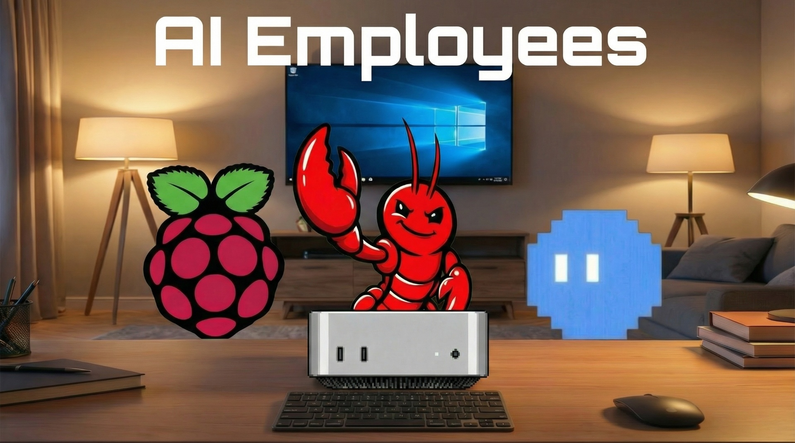

<div align="center">

# 🧠 AI Employees — Neural Bedroom Lab



**A neural command center where intelligent agents collaborate in real-time to execute complex tasks, connect to external tools, and deliver results.**

[](https://react.dev)
[](https://threejs.org)
[](https://www.typescriptlang.org)
[](https://tailwindcss.com)
[](https://vitejs.dev)

</div>

---

## 📑 Table of Contents

- [About the Project](#-about-the-project)
- [The AI Agents (Employees)](#-the-ai-agents-employees)
- [Features](#-features)
  - [3D Environment](#3d-environment)
  - [Agent System](#agent-system)
  - [CEO Task Mode](#ceo-task-mode)
  - [Connection Dock (MCP Integrations)](#connection-dock-mcp-integrations)
  - [Onboarding](#onboarding)
  - [Camera System](#camera-system)
- [Tech Stack](#-tech-stack)
- [Getting Started](#-getting-started)
- [Project Structure](#-project-structure)
- [Architecture](#-architecture)
- [License & Credits](#-license--credits)

---

## 🌐 About the Project

**AI Employees — Neural Bedroom Lab** is an immersive, cinematic 3D command center where four specialized AI agents live and work inside a stylized bedroom environment. Unlike conventional chat UIs or dashboard tools, this project places artificial intelligence inside a spatial, interactive world — blending real-time AI streaming, multi-agent orchestration, and rich 3D visualization into a single cohesive experience.

### What Makes It Unique

- **Real AI agents** — not mockups. Every agent streams responses from production-grade language models (Gemini 2.5/3 Pro/Flash, GPT-5/5-mini/5-nano/5.2) via a backend edge function.
- **Real-time streaming** — token-by-token output rendered live in the Task Console and reflected in the 3D environment through neural beams, TV visualizations, and ambient lighting.
- **Immersive 3D environment** — a fully modeled bedroom lab built with React Three Fiber, featuring desk stations, neural beams, a dynamic TV, cloud walls, floor lamps, and a star field — all reactive to agent state.
- **Multi-agent swarm orchestration** — CEO Task Mode coordinates all four agents through a structured four-phase pipeline to produce executive-grade deliverables.
- **MCP-style integration dock** — a 3D hardware rack representing external system connections (GitHub, Slack, Google Drive, Webhooks, Local Workspace) with per-agent permission controls.

---

## 🤖 The AI Agents (Employees)

Each agent occupies a dedicated desk station in the 3D bedroom and specializes in a distinct domain:

### Kimi CLI — *Planner*
| Attribute | Detail |
|-----------|--------|
| **Role** | System planner & command-style executor |
| **Color** | 🔵 Blue (`#3b82f6`) |
| **Strengths** | Task decomposition · Routing · Tool calling · Orchestration |
| **Description** | Breaks complex goals into actionable steps. Serves as the orchestrator in CEO Task Mode, decomposing directives and coordinating the other agents. |

### OpenClaw — *Creative*
| Attribute | Detail |
|-----------|--------|
| **Role** | Creative & communication specialist |
| **Color** | 🔴 Red (`#ef4444`) |
| **Strengths** | Ideation · Copywriting · UX thinking · Product strategy |
| **Description** | Generates ideas, names, copy, and product concepts. Handles the creative and UX strategy subtasks during swarm execution. |

### Mac Mini — *Coder*
| Attribute | Detail |
|-----------|--------|
| **Role** | Coding & implementation specialist |
| **Color** | 🟢 Green (`#10b981`) |
| **Strengths** | Clean code · Architecture · Debugging · Documentation |
| **Description** | Writes production-ready code and solves technical challenges. Produces code examples, architectural designs, and implementation plans. |

### Raspberry Pi — *Edge Automator*
| Attribute | Detail |
|-----------|--------|
| **Role** | Automation & integrations specialist |
| **Color** | 🟣 Purple (`#8b5cf6`) |
| **Strengths** | Webhooks · Automation · Monitoring · IoT patterns |
| **Description** | Builds scripts, monitors systems, and connects services. Handles automation scripts, integration hooks, and deployment workflows. |

---

## ✨ Features

### 3D Environment

The entire application exists inside a cinematic 3D bedroom rendered with **React Three Fiber** and **Drei**.

- **Four Desk Stations** — each agent has a dedicated desk with a loaded GLB character model (`clawd.glb`, `kimi.glb`, `macmini.glb`, `raspberrypi.glb`), colored accent lighting, and a floating name label.
- **Neural TV** — a large screen on the back wall that renders per-agent visualizations:
  - *Kimi CLI*: Terminal-style scrolling text
  - *OpenClaw*: Dynamic mind map / idea web
  - *Mac Mini*: CPU usage bars and system metrics
  - *Raspberry Pi*: IoT network node graph
- **Neural Beams** — glowing energy beams connecting each desk to a central hub, with intensity and color driven by the current `beamState` (idle, collaboration, processing, success).
- **Center Hub** — a central glowing orb that pulses with beam activity, serving as the visual focal point of the neural network.
- **Cloud Wall Material** — custom shader material on the walls with dynamic, state-reactive cloud patterns that shift based on agent activity.
- **Floor Lamps** — two modern minimalist floor lamps flanking the TV wall with warm ambient lighting (~2700K) that responds to beam state:
  - *Idle*: Low warm glow
  - *Planning/Collaboration*: Subtle brightness increase
  - *Processing*: Faint synchronized pulse with neural beams
  - *Error*: Gentle dim
  - *Success*: Brief warm glow increase, then return to normal
- **Star Field** — a particle-based star background with intensity tied to beam state, creating depth and atmosphere.
- **Camera Controller** — smooth interpolated camera transitions between multiple preset views (overview, desk focus, neural, overhead, TV).

### Agent System

- **Real AI Streaming** — messages are sent to a backend edge function that proxies requests to production LLM APIs and streams responses back via Server-Sent Events (SSE).
- **Multi-Model Support** — users can select from a wide range of models:
  - Google: Gemini 3 Flash Preview, Gemini 2.5 Flash, Gemini 2.5 Pro, Gemini 2.5 Flash Lite
  - OpenAI: GPT-5, GPT-5 Mini, GPT-5 Nano, GPT-5.2
- **Agent Event Timeline** — every agent action generates typed events (`planning`, `research`, `tool_call`, `generating`, `reviewing`, `complete`, `error`) displayed in a real-time timeline.
- **Task Console** — a slide-out chat panel with:
  - Full message history per agent
  - Model selector dropdown
  - Streaming token display
  - Event timeline sidebar

### CEO Task Mode

A premium multi-agent swarm orchestration system that coordinates all four agents to execute complex directives.

- **Executive Directive Modal** — a glass-morphism modal where users input their high-level directive with:
  - **Depth Selector**: Fast / Balanced / Deep execution modes
  - **Token Cap**: Budget control for maximum tokens per agent
  - **Tool Call Limit**: Budget control for maximum tool invocations
  - **Integration Toggles**: Enable GitHub, Slack, or Docs for the run
- **Four-Phase Execution Pipeline**:
  1. **Strategic Breakdown** — Kimi CLI decomposes the directive into four agent-specific subtasks
  2. **Parallel Work** — each agent executes their assigned subtask with streaming output
  3. **Internal Review** — Kimi CLI reviews all outputs for conflicts, gaps, and improvements
  4. **Final Consolidation** — produces a structured executive deliverable
- **Real-Time Execution Panel** — displays:
  - Current phase with progress indicator
  - Per-agent task cards with status badges (pending, running, reviewing, done, error)
  - Live streaming output per agent
  - Elapsed time tracker
- **Execution Controls**: Pause, Resume, and Abort buttons
- **Structured Executive Output**:
  - Executive Summary
  - Key Decisions
  - Deliverables (numbered with details)
  - Next Steps

### Connection Dock (MCP Integrations)

A 3D hardware rack labeled **"External Systems"** positioned near the TV, representing Model Context Protocol integrations.

- **Five Integration Modules**:
  | Module | Icon | Description |
  |--------|------|-------------|
  | **GitHub** | ⌥ | Create repos, branches, commits, PRs, and comment on issues |
  | **Slack** | ◈ | Send messages, post summaries, and respond to commands |
  | **Google Drive** | △ | Create, update, and read documents and project knowledge |
  | **Webhook Bridge** | ⟁ | Send structured POST requests and trigger automations |
  | **Local Workspace** | ◻ | Create, edit, and diff files with user approval |

- **Per-Integration Status LEDs** — visual indicators for connection state:
  - 🟢 Connected
  - 🟡 Needs Re-auth
  - 🔴 Error
  - ⚫ Disconnected
- **Per-Agent Permission Toggles** — granular control over which agents can access which integrations.
- **Integrations Panel** — a glass-morphism UI overlay listing all integrations with capabilities, status, and agent permissions.
- **Dynamic Glow & Pulse** — LED animations and glow effects that respond to integration activity state.

### Onboarding

- **Agent Selection Overlay** — on first visit, users are presented with a full-screen overlay to select their primary AI agent. Each agent card displays the name, role, strengths, and description.
- **Agent Switching** — the primary agent can be changed at any time via the top bar button.

### Camera System

- **Camera Control Pad** — an on-screen control with preset camera angles:
  - **Overview**: Full room perspective
  - **Desk Focus**: Zoom into a specific agent's desk
  - **Neural**: Top-down view of the beam network
  - **Overhead**: Bird's-eye room view
  - **TV**: Close-up of the Neural TV
- **Smooth Transitions** — all camera movements use interpolated easing for cinematic feel.

---

## 🛠 Tech Stack

| Technology | Purpose |
|-----------|---------|
| **React 18** | UI framework with hooks and functional components |
| **TypeScript** | Type-safe development across the entire codebase |
| **Vite** | Lightning-fast build tool and dev server |
| **Three.js** | 3D rendering engine |
| **React Three Fiber** | React renderer for Three.js |
| **Drei** | Helper components for R3F (loaders, controls, shaders) |
| **Tailwind CSS** | Utility-first CSS framework |
| **shadcn/ui** | Accessible, customizable UI component library |
| **Lovable Cloud** | Backend infrastructure (edge functions, database, auth) |
| **Recharts** | Data visualization and charting |
| **Zod** | Runtime schema validation |
| **React Router DOM** | Client-side routing |
| **TanStack React Query** | Async state management and caching |
| **Framer Motion** | Animation library (via CSS transitions) |

---

## 🚀 Getting Started

### Prerequisites

- [Node.js](https://nodejs.org/) (v18 or higher)
- npm (included with Node.js)

### Installation

```bash
# 1. Clone the repository
git clone <YOUR_GIT_URL>

# 2. Navigate to the project directory
cd <YOUR_PROJECT_NAME>

# 3. Install dependencies
npm install

# 4. Start the development server
npm run dev
```

The application will be available at `http://localhost:5173`.

### Environment Variables

The project requires the following environment variables (automatically configured when using Lovable Cloud):

```env
VITE_SUPABASE_URL=<your-backend-url>
VITE_SUPABASE_PUBLISHABLE_KEY=<your-publishable-key>
```

---

## 📁 Project Structure

```
├── public/
│   ├── models/                  # GLB 3D character models
│   │   ├── clawd.glb
│   │   ├── kimi.glb
│   │   ├── macmini.glb
│   │   └── raspberrypi.glb
│   └── images/
│       └── hero.jpg             # Repository hero image
├── src/
│   ├── components/
│   │   ├── 3d/                  # Three.js / R3F components
│   │   │   ├── CameraController.tsx
│   │   │   ├── CenterHub.tsx
│   │   │   ├── CloudWallMaterial.tsx
│   │   │   ├── ConnectionDock.tsx
│   │   │   ├── DeskStation.tsx
│   │   │   ├── FloorLamp.tsx
│   │   │   ├── NeuralBeams.tsx
│   │   │   ├── NeuralTV.tsx
│   │   │   └── Room.tsx
│   │   ├── panels/              # UI overlay panels
│   │   │   ├── CEOExecutionPanel.tsx
│   │   │   ├── CEOTaskModal.tsx
│   │   │   ├── ConnectionsPanel.tsx
│   │   │   ├── IntegrationsPanel.tsx
│   │   │   ├── OnboardingOverlay.tsx
│   │   │   ├── TaskConsole.tsx
│   │   │   └── TopBar.tsx
│   │   ├── BedroomScene.tsx     # Main 3D scene orchestrator
│   │   ├── CameraControlPad.tsx
│   │   ├── HUD.tsx
│   │   └── NavLink.tsx
│   ├── lib/
│   │   ├── agents.ts            # Agent profiles, models, types
│   │   ├── agentStream.ts       # SSE streaming client
│   │   ├── ceoSwarm.ts          # CEO swarm orchestration engine
│   │   ├── integrations.ts      # MCP integration definitions
│   │   └── utils.ts
│   ├── pages/
│   │   ├── Index.tsx            # Main application page
│   │   └── NotFound.tsx
│   └── main.tsx                 # Application entry point
├── supabase/
│   └── functions/
│       └── agent-chat/
│           └── index.ts         # Backend edge function for AI streaming
└── package.json
```

---

## 🏗 Architecture

```
┌─────────────────────────────────────────────────────────┐
│                      Browser Client                      │
│                                                          │
│  ┌──────────┐  ┌──────────────┐  ┌───────────────────┐  │
│  │ Onboarding│→│ Task Console  │→│  Agent Stream (SSE)│  │
│  │ Overlay   │  │ (Chat + Model)│  │  Client           │  │
│  └──────────┘  └──────┬───────┘  └─────────┬─────────┘  │
│                        │                     │            │
│                        ▼                     ▼            │
│  ┌─────────────────────────────────────────────────────┐ │
│  │              BedroomScene (R3F Canvas)               │ │
│  │                                                      │ │
│  │  ┌─────────┐ ┌──────────┐ ┌─────────┐ ┌──────────┐ │ │
│  │  │Desk Stn │ │Neural TV │ │ Beams   │ │Floor Lamp│ │ │
│  │  │(×4)     │ │          │ │         │ │(×2)      │ │ │
│  │  └─────────┘ └──────────┘ └─────────┘ └──────────┘ │ │
│  │  ┌─────────┐ ┌──────────┐ ┌─────────┐              │ │
│  │  │Cloud    │ │Center Hub│ │Conn Dock│              │ │
│  │  │Walls    │ │          │ │(MCP)    │              │ │
│  │  └─────────┘ └──────────┘ └─────────┘              │ │
│  └─────────────────────────────────────────────────────┘ │
│                                                          │
│  ┌─────────────────────────────────────────────────────┐ │
│  │           CEO Swarm Engine (ceoSwarm.ts)             │ │
│  │  Phase 1: Strategic Breakdown (Kimi CLI)             │ │
│  │  Phase 2: Parallel Work (All 4 Agents)               │ │
│  │  Phase 3: Internal Review (Kimi CLI)                 │ │
│  │  Phase 4: Final Consolidation                        │ │
│  └──────────────────────┬──────────────────────────────┘ │
└─────────────────────────┼────────────────────────────────┘
                          │ SSE Stream
                          ▼
┌─────────────────────────────────────────────────────────┐
│                 Backend Edge Function                     │
│              (supabase/functions/agent-chat)              │
│                                                          │
│  • Receives messages + agent ID + model selection        │
│  • Proxies to LLM API (Gemini / GPT)                    │
│  • Streams tokens back via Server-Sent Events            │
│  • Emits agent events (planning, generating, complete)   │
└─────────────────────────────────────────────────────────┘
```

### Data Flow

1. **User selects an agent** via the onboarding overlay on first visit (stored in local state).
2. **Task Console** accepts user messages and sends them to the backend edge function along with the selected agent ID and model.
3. **Edge function** proxies the request to the appropriate LLM API and streams tokens back via SSE.
4. **Agent events** (`planning`, `research`, `tool_call`, `generating`, `reviewing`, `complete`, `error`) are emitted during streaming and drive:
   - Neural beam intensity and color
   - TV visualization content
   - Floor lamp ambient brightness
   - Cloud wall shader parameters
   - Star field intensity
5. **CEO Task Mode** uses the `CEOSwarmEngine` class to coordinate all four agents through a structured four-phase pipeline, with each phase producing events that update the 3D environment in real-time.

---

## 📄 License & Credits

3D character models are custom assets included in the `public/models/` directory.

---

<div align="center">

**Built with 🧠 by AI Employees**

*Where artificial intelligence meets spatial computing.*

</div>
